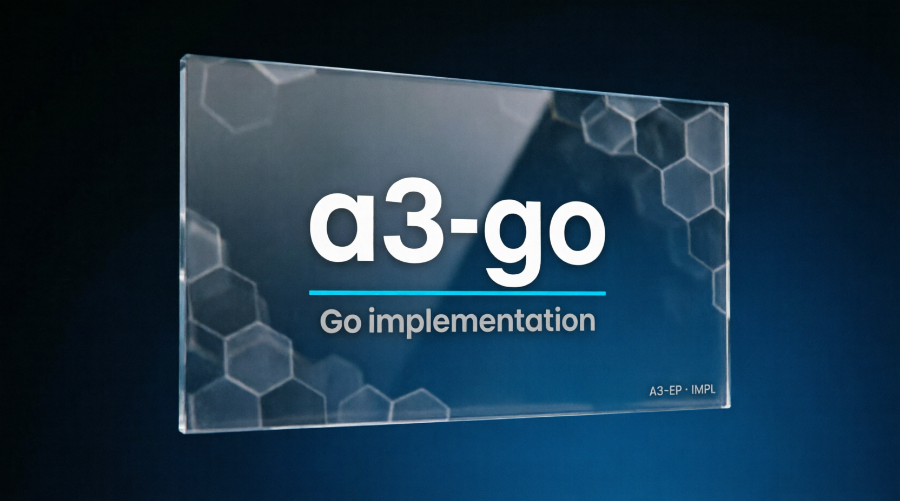

# a3-go — A3-EP Go reference



## What it is

A Go CORE implementation of A3-EP v0.2.0, written from the normative specification and lock vectors. It provides JCS, CloudEvents, temporal ordering, truth, confidence, provenance, and explicit rejection.

## What it is not

It is not a port of Kotlin or TypeScript source, not an A3UI renderer, and not a claim of production deployment or universal numerical behavior outside the lock corpus.

## Status

- **VERIFIED:** `go test ./...`, lock v2 canonical bytes, category rejects, and stdlib-only CORE boundaries.
- **UNVERIFIED:** third-party adoption and physical deployment.

## Get it

```bash
git clone https://github.com/valeriobitzone-png/a3-go.git
cd a3-go
# Requirements: Go 1.22+.
# GO-009 checks these pinned sibling repositories for a clean boundary:
git clone https://github.com/valeriobitzone-png/a3.git ../a3
git -C ../a3 checkout closeout-v1.0
git clone https://github.com/valeriobitzone-png/a3-ts.git ../a3-ts
git -C ../a3-ts checkout prepub-v1.0
```

Structure: `envelope/`, `jcs/`, `temporal/`, `truth/`, `confidence/`, `reject/`, and `conformance/`. Runtime dependencies are standard library only.

## Prove it

```bash
go test ./...
```

Expected result: all packages pass and the shared lock-vector SHA-256 values match.

## Integrate it

Treat this repository as a reference implementation. Keep the documented `../a3` and `../a3-ts` siblings at their pinned tags, read `../a3/spec/SPEC_A3-EP.md`, reuse the conformance tests as a template for your language, and verify your own envelopes against the shared vectors. Do not copy implementation code.

## License

Implementation code is Apache-2.0. The governing protocol specification and schemas are CC BY 4.0 in `../a3/spec/`.

## Provenance

Measured: Go test output, canonical lock bytes, and reject cases. The documented recency ULP difference is an explicit implementation divergence from the lock's stored value, not a hidden claim of numerical identity beyond the corpus.
